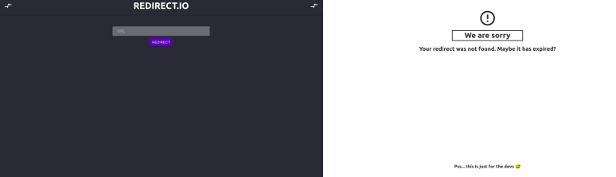

# redirect.io

## Overview

`Redirect.io` is a simple url-shortner.

It takes any url, creates a random generated short url that redirects you to your original site.

It's basic and simple but fulfills it's intended purpose: it's a personal use url shortner. 

## Backend
It's just NodeJS using express and rest api.

The database is mongoDB Atlas.

## Frontend

It's a simple React front-end, with main page and an error page.